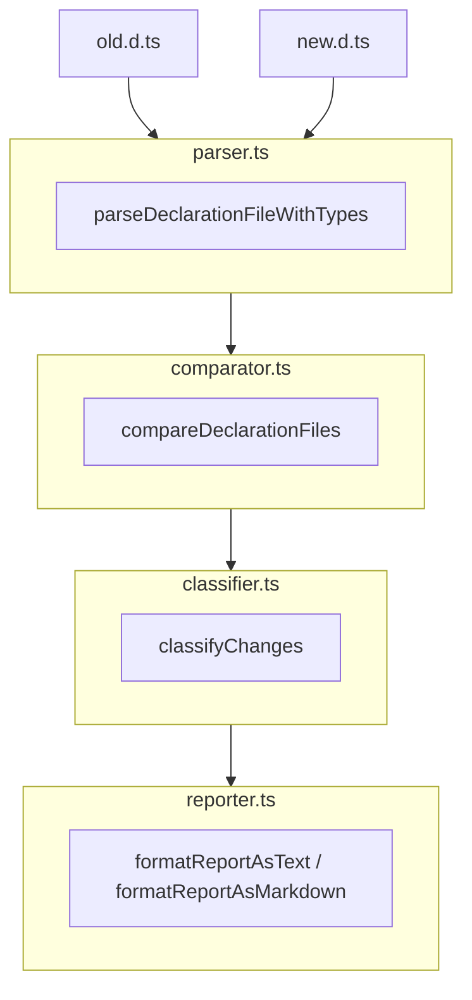

# Change Detector Architecture

This document provides architectural context for the `@api-extractor-tools/change-detector` package. It is intended to help developers (and LLMs) understand the codebase structure, key design decisions, and important technical details.

## Purpose

This package compares two TypeScript declaration file (`.d.ts`) rollups and classifies the delta according to [Semantic Versioning](https://semver.org/) rules. It is designed to work with rollups generated by `@microsoft/api-extractor`.

## Module Structure

```
src/
├── types.ts       # Core type definitions
├── parser.ts      # Declaration file parsing
├── comparator.ts  # Symbol comparison logic
├── classifier.ts  # Change classification
├── reporter.ts    # Output formatting
├── index.ts       # Public API
└── cli.ts         # CLI entry point
```

### Data Flow



## Key Components

### types.ts

Defines all public interfaces. Key types:

- **`ReleaseType`**: `"major" | "minor" | "patch" | "none"` - The semver classification
- **`ChangeCategory`**: Specific change types like `"symbol-added"`, `"param-added-required"`, etc.
- **`Change`**: A single detected change with symbol info, category, and explanation
- **`ComparisonReport`**: The complete report with grouped changes and statistics

### parser.ts

Parses `.d.ts` files using the TypeScript Compiler API.

**Key functions:**
- `parseDeclarationFile()` - Returns symbols with human-readable signatures
- `parseDeclarationFileWithTypes()` - Returns symbols with TypeScript `ts.Symbol` references for deep comparison

**Important implementation details:**

1. **Creating a TypeScript Program**: We create a standalone `ts.Program` for each file:
   ```typescript
   const program = ts.createProgram([filePath], {
     target: ts.ScriptTarget.Latest,
     module: ts.ModuleKind.ESNext,
     moduleResolution: ts.ModuleResolutionKind.Node10,
   });
   ```

2. **Getting Exports**: We use the TypeChecker to get module exports:
   ```typescript
   const moduleSymbol = checker.getSymbolAtLocation(sourceFile);
   const exports = checker.getExportsOfModule(moduleSymbol);
   ```

3. **Resolving Aliases**: Export symbols may be aliases; resolve them:
   ```typescript
   const resolvedSymbol = exportSymbol.flags & ts.SymbolFlags.Alias
     ? checker.getAliasedSymbol(exportSymbol)
     : exportSymbol;
   ```

4. **Structural Signatures for Interfaces**: The default `typeToString()` for interfaces just returns the name. We expand them to show properties:
   ```typescript
   function getStructuralSignature(type: ts.Type, checker: ts.TypeChecker): string {
     const properties = type.getProperties();
     // Build "{ prop1: type1; prop2?: type2 }" format
   }
   ```

### comparator.ts

Compares symbols between old and new parsed files.

**Key function:** `analyzeTypeChange()` - Determines the nature of a type change.

**Important implementation details:**

1. **Signature Comparison is Authoritative**: We compute human-readable signatures in the parser and compare those first. This catches interface property changes that TypeScript's type comparison might miss (since both interfaces have the same name).

2. **Function Analysis**: For functions, we analyze:
   - Parameter count changes (added/removed)
   - Whether new parameters are optional (check `questionToken` or `initializer`)
   - Return type changes
   - Parameter type changes

3. **Cross-Program Type Comparison Limitation**: TypeScript's `isTypeIdenticalTo()` doesn't work across different `ts.Program` instances. We work around this by comparing string representations of types.

4. **Conservative Approach**: When we can't determine the exact nature of a change, we assume it's breaking (`"major"`). It's better to over-report breaking changes than miss them.

### classifier.ts

Groups changes by impact and determines overall release type.

**Logic:**
- If any change is `"major"` → overall is `"major"`
- Else if any change is `"minor"` → overall is `"minor"`  
- Else if any change is `"patch"` → overall is `"patch"`
- Else → `"none"`

### reporter.ts

Formats reports in three formats:
- **Text**: Human-readable console output
- **Markdown**: For documentation/changelogs
- **JSON**: For programmatic consumption

## Change Categories and Their Semver Impact

| Category | Release Type | Description |
|----------|--------------|-------------|
| `symbol-removed` | major | Export was removed from public API |
| `symbol-added` | minor | New export added to public API |
| `type-narrowed` | major | Type became more restrictive |
| `type-widened` | minor | Type became more permissive |
| `param-added-required` | major | New required parameter added |
| `param-added-optional` | minor | New optional parameter added |
| `param-removed` | major | Parameter was removed |
| `return-type-changed` | major | Function return type changed |
| `signature-identical` | none | No changes detected |

## Testing Approach

Tests use `vitest` with `fixturify-project` to create temporary test fixtures.

**Pattern:**
```typescript
const project = new Project("test-pkg");
project.files = {
  "old.d.ts": `export declare function foo(): void;`,
  "new.d.ts": `export declare function foo(): string;`,
};
await project.write();

const report = compareDeclarations({
  oldFile: path.join(project.baseDir, "old.d.ts"),
  newFile: path.join(project.baseDir, "new.d.ts"),
});

expect(report.releaseType).toBe("major");
```

## Known Limitations

1. **Cross-file type references**: When a `.d.ts` file references types from other files (e.g., `import { Foo } from './other'`), those types may not resolve correctly since we only load the single rollup file.

2. **Generic type parameter changes**: We don't deeply analyze changes to generic type parameters beyond signature comparison.

3. **Overloaded functions**: We only analyze the first call signature for functions with multiple overloads.

4. **Namespace contents**: We track namespace exports at the top level but don't deeply compare namespace member changes.

5. **Class member visibility**: We don't distinguish between public/private/protected member changes.

## Future Enhancement Ideas

1. **Improved type compatibility checking**: Use a shared TypeScript program that loads both files to enable `isTypeAssignableTo()` checks.

2. **More granular interface analysis**: Detect specific property additions/removals/changes within interfaces.

3. **Generic type parameter analysis**: Analyze covariance/contravariance of type parameter changes.

4. **Deprecation detection**: Detect `@deprecated` tag additions as a special change category.

5. **Breaking change explanations**: Provide more detailed explanations of why a change is breaking (e.g., "Parameter 'prefix' is now required, which will break existing callers that don't provide it").

## Dependencies

- **typescript**: Used as a runtime dependency (not just dev) since we use the Compiler API for parsing and type analysis.

## CLI Usage

```bash
change-detector <old.d.ts> <new.d.ts> [options]

Options:
  --json        Output as JSON
  --markdown    Output as markdown
  --help, -h    Show help
```

## Library Usage

```typescript
import { 
  compareDeclarations,
  formatReportAsText,
  formatReportAsMarkdown,
  reportToJSON,
} from '@api-extractor-tools/change-detector';

const report = compareDeclarations({
  oldFile: './dist/v1/index.d.ts',
  newFile: './dist/v2/index.d.ts',
});

// Access structured data
console.log(report.releaseType);           // "major" | "minor" | "patch" | "none"
console.log(report.changes.breaking);      // Change[]
console.log(report.changes.nonBreaking);   // Change[]
console.log(report.stats);                 // { added, removed, modified, unchanged }

// Format for output
console.log(formatReportAsText(report));
console.log(formatReportAsMarkdown(report));
console.log(JSON.stringify(reportToJSON(report), null, 2));
```

